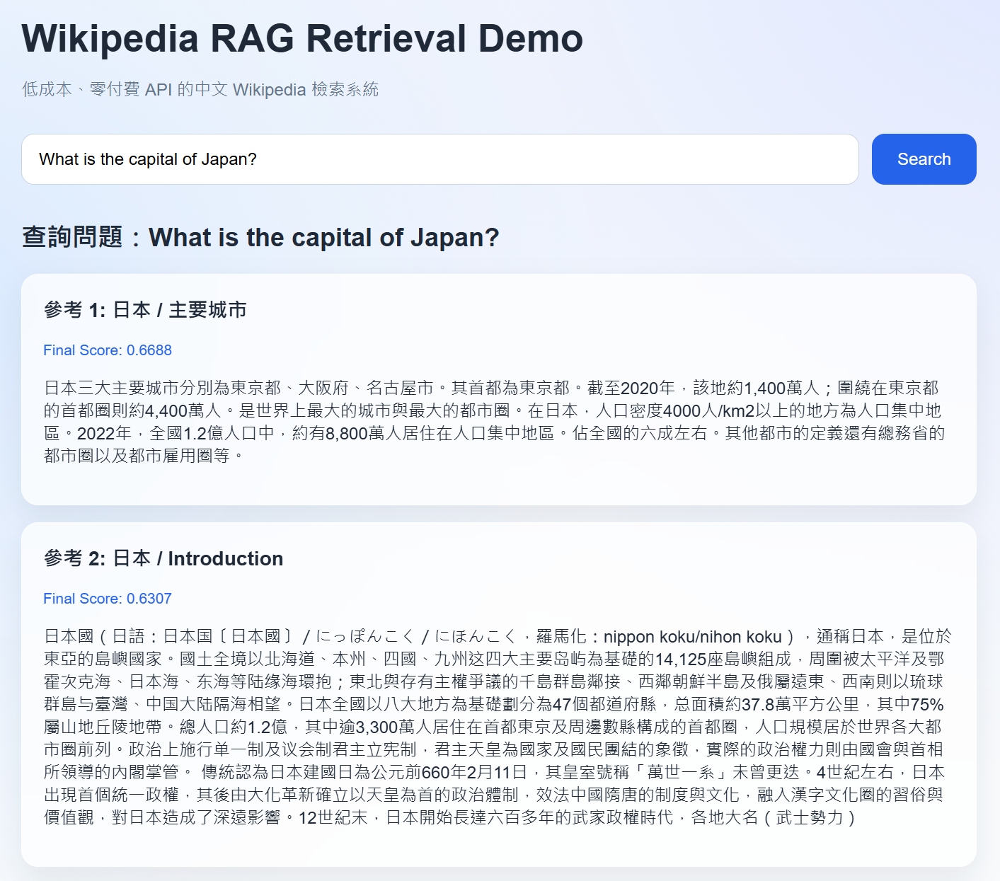
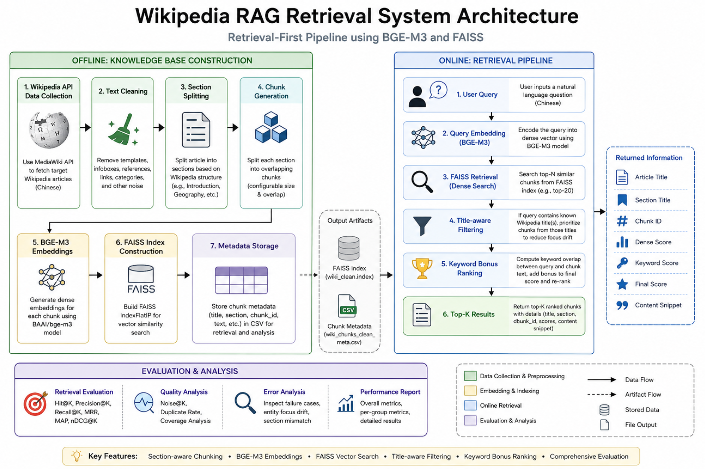
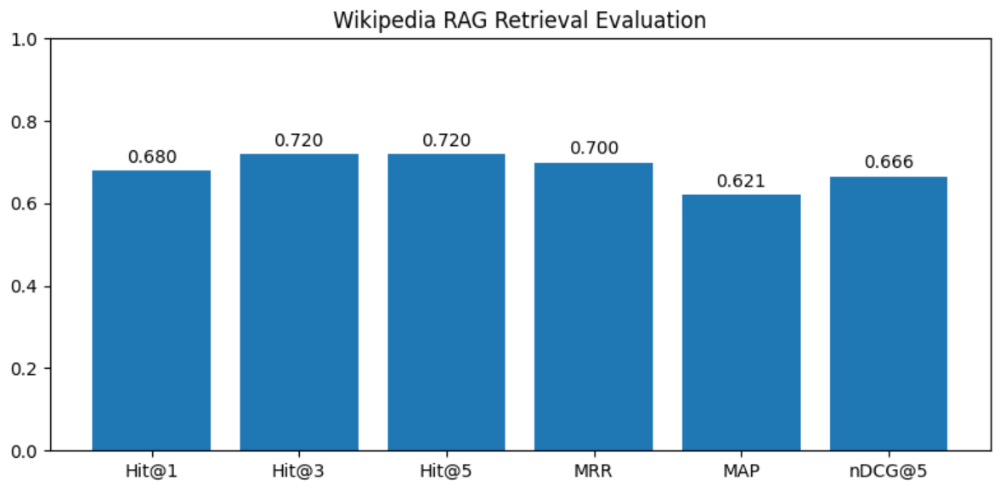

# Wikipedia RAG Retrieval System

[English](README.md) | [繁體中文](README_zh.md)

## Project Overview

This project implements a retrieval-first Retrieval-Augmented Generation (RAG) pipeline for Chinese Wikipedia articles.

Unlike many RAG demonstrations that rely heavily on commercial LLM APIs, this project focuses on the core retrieval layer:

* Knowledge base construction
* Text preprocessing
* Section-aware chunking
* Embedding generation
* Vector search
* Retrieval optimization
* Retrieval evaluation
* Error analysis

The system is designed to be reproducible, maintainable, and deployable without requiring paid API services.

### Key Focus

- Retrieval pipeline design
- Retrieval evaluation framework
- Retrieval error analysis
- Retrieval strategy optimization
- FastAPI-based application packaging

---
## Demo



---

## Project Highlights

---

- Built an end-to-end Wikipedia retrieval pipeline
- Implemented FAISS-based semantic vector search
- Used BGE-M3 embeddings for Chinese semantic retrieval
- Developed a 50-question section-level benchmark dataset
- Built a retrieval evaluation framework with Hit@K, MRR, MAP, and nDCG
- Packaged the system with FastAPI and a simple web interface

Key results:

| Metric | Score |
|--------|------:|
| Hit@1 | 0.68 |
| Hit@3 | 0.72 |
| MRR | 0.70 |
| MAP | 0.621 |
| nDCG@5 | 0.666 |

---

## Skills Demonstrated

- Information Retrieval (IR)
- Retrieval-Augmented Generation (RAG)
- Embedding Models
- Vector Databases
- FAISS
- FastAPI
- REST API Development
- Evaluation Framework Design
- Error Analysis
- Python Software Engineering

---

## Motivation

Many beginner RAG projects focus only on connecting an LLM API.

However, retrieval quality often determines the upper bound of a RAG system.

This project was created to explore:

* How to build a domain knowledge base
* How chunking strategies affect retrieval
* How embedding-based retrieval behaves
* How retrieval performance can be measured objectively
* How retrieval failures can be analyzed and improved

---
## Why This Project Matters

In a Retrieval-Augmented Generation system, the language model generates answers, while the retrieval layer provides the supporting knowledge.

If the retrieved context is incorrect or incomplete, even a powerful LLM may produce inaccurate or hallucinated answers.

Therefore, this project focuses on improving and evaluating retrieval quality before adding a generation layer.

This makes the system useful for understanding the core engineering challenges behind RAG applications.

---

## Project Status

This project currently focuses on retrieval evaluation and FastAPI-based demonstration.

The current implementation includes:

- Knowledge base construction
- Section-aware chunking
- Embedding generation
- FAISS vector retrieval
- Retrieval evaluation
- Error analysis
- FastAPI web interface

Full Retrieval-Augmented Generation (RAG) with answer generation is planned as a future improvement through local or cloud-based LLM integration.

---


## System Architecture



The system is divided into two major pipelines:

- **Offline Knowledge Base Construction**: collects and preprocesses Wikipedia articles, generates embeddings, and builds a FAISS vector index.
- **Online Retrieval Pipeline**: receives user queries, retrieves candidate chunks, applies title-aware filtering and keyword bonus ranking, and returns top-k results.

---
## Evaluation Result

50 manually constructed benchmark questions were used to evaluate section-level retrieval performance.



Key metrics:

| Metric | Score |
|----------|--------:|
| Hit@1 | 0.68 |
| Hit@3 | 0.72 |
| Hit@5 | 0.72 |
| MRR | 0.70 |
| MAP | 0.621 |
| nDCG@5 | 0.666 |

The benchmark highlights strong retrieval performance for single-entity questions while exposing limitations in multi-entity queries, providing clear directions for future retrieval optimization.

---

## Features

### Knowledge Base Construction

* Fetches Chinese Wikipedia articles using MediaWiki API
* Supports multiple article ingestion
* Removes low-quality sections and noisy references
* Cleans Wikipedia-specific artifacts

### Text Processing

* Section-based document segmentation
* Overlapping chunk generation
* Configurable chunk size and overlap

### Retrieval

* Dense retrieval using embeddings
* BGE-M3 multilingual embedding model
* FAISS local vector search
* Title-aware filtering
* Keyword-enhanced ranking

### Evaluation

* Custom evaluation benchmark
* Section-level relevance assessment
* Retrieval metrics:

  * Hit@K
  * Precision@K
  * Recall@K
  * MRR
  * MAP
  * nDCG
  * Noise Rate
  * Duplicate Rate

### Deployment

* FastAPI backend
* Interactive web interface
* REST API endpoints
* Local deployment without cloud dependencies

---

## Technology Stack

### Backend

* Python
* FastAPI

### Data Processing

* Pandas
* NumPy

### Retrieval

* Sentence Transformers
* BAAI/bge-m3
* FAISS

### Data Source

* MediaWiki API

### Frontend

* HTML
* CSS
* JavaScript

---

## Project Structure

```text
wikipedia-rag-retrieval-system/
│
├── main.py
├── requirements.txt
├── README.md
├── README_zh.md
│
├── src/
│   ├── api.py
│   ├── config.py
│   ├── wiki_fetcher.py
│   ├── text_processor.py
│   ├── build_corpus.py
│   ├── build_index.py
│   ├── retriever.py
│   ├── chat_cli.py
│   └── evaluate.py
│
├── templates/
│   └── index.html
│
├── static/
│   └── style.css
│
├── data/
│   ├── processed/
│   └── index/
│
├── outputs/
│   └── eval/
│
└── docs/
    ├── architecture.png
    ├── demo.png
    └── evaluation_result.png
```

---

## Installation

Create a virtual environment:

```bash
python -m venv .venv
```

Activate environment (Windows):

```bash
.\.venv\Scripts\activate
```

Install dependencies:

```bash
pip install -r requirements.txt
```

---

## Usage

### Step 1: Build Corpus

```bash
python -m src.build_corpus
```

This step:

* Downloads Wikipedia articles
* Splits articles into sections
* Creates retrieval chunks
* Exports processed CSV files

Outputs:

```text
data/processed/wiki_sections_clean.csv
data/processed/wiki_chunks_clean.csv
```

---

### Step 2: Build Vector Index

```bash
python -m src.build_index
```

This step:

* Generates embeddings
* Creates FAISS index
* Stores metadata

Outputs:

```text
data/index/wiki_clean.index
data/index/wiki_chunks_clean_meta.csv
```

---

### Step 3: Run Web Application

```bash
uvicorn src.api:app --reload
```

Open:

```text
http://127.0.0.1:8000
```

API documentation:

```text
http://127.0.0.1:8000/docs
```

---

### Step 4: Run Evaluation

```bash
python -m src.evaluate
```

Outputs:

```text
outputs/eval/rag_eval_results.csv
outputs/eval/rag_eval_summary.csv
outputs/eval/rag_eval_errors.csv
outputs/eval/rag_eval_group_summary.csv
```

---

## Retrieval Strategy

### Dense Retrieval

The system uses BGE-M3 embeddings and FAISS cosine similarity search.

### Title-aware Filtering

When a query explicitly mentions a known article title, retrieval candidates from that title receive priority.

Example:

```text
東京都是不是日本的一級行政區？
```

The retriever prioritizes chunks belonging to:

```text
東京都
```

instead of unrelated articles.

### Keyword Bonus Ranking

A keyword matching score is added to the dense retrieval score.

```text
final_score =
dense_score +
0.05 × keyword_score
```

This improves retrieval robustness for entity-heavy queries.

---

## Detailed Evaluation Results

A manually constructed benchmark containing 50 section-level questions was used.

| Scope            | Hit@1 | Hit@3 | Hit@5 |  MRR |   MAP | nDCG@5 |
| ---------------- | ----: | ----: | ----: | ---: | ----: | -----: |
| Overall          |  0.68 |  0.72 |  0.72 | 0.70 | 0.621 |  0.666 |
| Japan            |  0.92 |  0.96 |  0.96 | 0.94 | 0.861 |  0.906 |
| Tokyo Metropolis |  0.44 |  0.48 |  0.48 | 0.46 | 0.380 |  0.426 |

---

## Error Analysis

Most retrieval failures occur in multi-entity queries.

Examples:

```text
東京都是不是日本的首都所在地？
東京都屬於日本的哪一級行政區？
東京都在日本的政治與行政上有何地位？
```

The retriever sometimes shifts focus from:

```text
Tokyo Metropolis
```

to:

```text
Japan
```

This behavior is known as:

```text
Entity Focus Drift
```

and represents an important future optimization direction.

---

## Current Limitations

* Retrieval-focused system (not full RAG generation)
* No local or cloud LLM integration
* Limited benchmark size
* No BM25 retrieval
* No reranker model
* No query rewriting

---

## Future Improvements

### Retrieval

* BM25 sparse retrieval
* Hybrid retrieval
* Query rewriting
* Entity boosting
* Section-aware ranking

### Ranking

* Cross-Encoder reranker
* Reciprocal Rank Fusion (RRF)

### Generation

* Local LLM integration
* Ollama deployment
* Citation-based answer generation

### Engineering

* Docker support
* CI/CD pipeline
* Cloud deployment

---

## Author

Noah Peng

Data Analyst & AI Practitioner

National Taipei University

Wikipedia RAG Retrieval Practice Project
